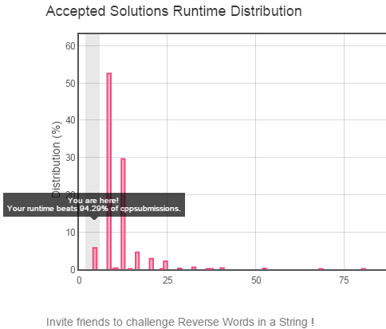
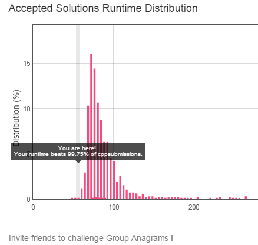

*Generated at Sun Oct 24 00:49:43 2021 by [gen_readme.py](gen_readme.py)*


Collection of my notes on coding and solutions to various small problems, a reminder to myself.

The language used is C++ (C++ 14 features used), the dependencies are:

 1. [boost](http://www.boost.org/).
 1. [Catch](https://github.com/philsquared/Catch) unit test. See Catch's docs on [command line options and arguments](https://github.com/philsquared/Catch/blob/master/docs/command-line.md).

All examples/tests are tagged, run this to list all tags:

```
./note -t 
```
Run this to list all examples/tests:

```
./note -l
```
This will run all examples/tests whose name start with "Add" and are tagged with "leetcode". `-d y` is to show how much test is used for each test:

```
./notes 'Add*' '[leetcode]'  -d y
```

# C++ Notes
## Boost Library
### [Use `in_place` with `optional`](src/c++notes/boost.cpp#L17)

`optional` may or may not hold a valid object, it overrides `bool` operator to indicate if a valid object is being held or not. 
It also overrides operator `.` and `->` so the underlying object can be operated as pointer, if it is valid.

The underlying object held by `optional` can be initialized in-place by using Boost's in place factory. 
`optional` overrides `=` operator which has a in-place factory as right hand argument.

For example, for the following class

```c++
struct Arg1{
    Arg1(int v):value_(v){}
    int value_;
    int value() {return value_;}
};

struct Arg2{
    Arg2(int v):value_(v){}
    int value_;
    int value() {return value_;}
};

template<typename T1, typename T2>
struct Test2Arg
{
    Test2Arg(const Test2Arg&) = delete;
    Test2Arg(T1& v1, T2 v2):m1(v1.value()),m2(v2.value()){}
    int m1,m2;
    int f1() {return m1;}
    int f2() {return m2;}
};
```

Declare two instances.

```c++
    Arg1 a1(100);
    Arg2 a2(200);
```
`t1` below is an optional but is initialized with an `Test2Arg` instance in place:
- Note `Test2Arg` does not have copy constructor, so the value is not intialized in temp object and then copied.
- Note `Test2Arg` expects the first parameter of its constructor be non-const reference, but `boost::in_place()` only accepts either const reference
  or by-value as parameter, so we wrap `a1` inside `boost::inplace` to make it a by-value parameter.
```c++
    boost::optional<typename CxxBoost::Test2Arg<Arg1, Arg2>> t1(boost::in_place(boost::ref(a1), a2));
```
The following code cannot compile
```c++
    Test2Arg t2(t1);
```
## Interesting C++ stuff learned from Internet
cppcon | [2017 Curiously Recurring C++ Bugs at Facebook](https://www.youtube.com/watch?v=3MB2iiCkGxg&t=184s)

//[bug #1 - implicitly insert new element](src/c++notes/cpp-con/fb-recurring-bugs.cpp#L11)
## Modern C++
### static assert

 `static_assert` is a new C++ keyword, the assertion happens at compile time, if the assertion is true the static assert expression has no effect.

```c++
namespace{
    struct MyAlignmentSensitiveStuff{
        uint8_t i;
        uint32_t d;
    };

    void do_stuff(){
        // if data type of i is changed to something else with a different size,
        // or more member is inserted in the front of it
        // the following won't compile
        static_assert(offsetof(MyAlignmentSensitiveStuff, d) == 4,
                      "Wrong offset of d in MyAlignmentSensitiveStuff");
    }
}
```
  `static_assert` can also be used to generate [meaningful compile error](src/c++notes/modern-c++/cxx11.cpp#L32) if an unmatched partial template specialization is detected.
```c++
namespace{
    template <typename T> class MyTemplatedClass{
        // if none of the specialized version is matched T's size will be zero
        // and the following guarantees a compiler error with user defined error message
        static_assert(sizeof(T) == 0,
                      "Not sepcialized for this data type");
    };
    template <typename T> class MyTemplatedClass<T*>{};

    MyTemplatedClass<int*> ptr;
    // uncomment the following line to get a compile error
    //MyTemplatedClass<int> not_specialized;
}
```
# [Leetcode](https://leetcode.com/)
## [Reverse words in a string](src/leetcode/reverse_words.cpp#L12)

[Leetcode #151](https://leetcode.com/problems/reverse-words-in-a-string/)

An in-place `O(1)` space solution, beats 94.29% of C++ submissions.

 
## [Group Anagrams](src/leetcode/group_anagrams.cpp#L15)

[Leetcode #49](https://leetcode.com/problems/anagrams/).

Use a hash map to group anagrams, but instead of using a sorted string as key (so the default string hash code function would return same hash code for all subjects of the same anagram, it will work but the run time will be penalized for the sorting of every key), the solution implments a customized hash code function which uses the first 26 prime numbers to represent the 26 lower case letters and calculates the hash code by mulitplying them, to reflect the fact that 1) we only care about different letters 2) ordering does not matter.

Beats 99.75% of C++ submissions.

 

